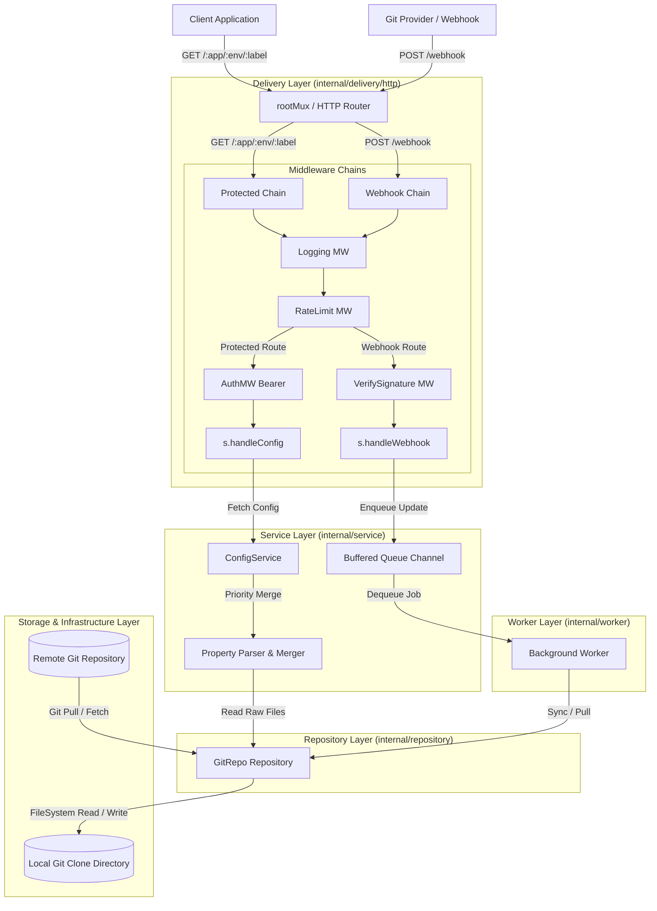

# ARCHITECTURE.md

## 1. Alur Sistem & Data Flow (Mermaid Diagram)

Diagram berikut menggambarkan alur interaksi dari HTTP Request (Client, Webhook, & Monitoring) melalui layer-layer arsitektur Conflect:

---

## 2. Deskripsi Arsitektur Layer

Conflect mengadopsi arsitektur berlapis (*Layered Architecture*) yang bersih dengan pembagian tanggung jawab (*Separation of Concerns*) yang tegas:

### A. Entrypoint Layer (`cmd/conflect/`)
* **Tanggung Jawab**: Titik masuk utama aplikasi (`main.go`). Membaca konfigurasi aplikasi, menginisialisasi objek-objek dependencies (Dependency Injection), menjalankan background worker goroutine, dan mengatur *graceful shutdown* untuk server HTTP.

### B. Delivery Layer (`internal/delivery/http/`)
* **Tanggung Jawab**: Menangani *transport layer* HTTP.
* **Routing & Middleware Policy**:
  * **Unprotected Endpoints (`/health`, `/metrics`)**: Langsung ditangani tanpa melewati *middleware chain* (tanpa Rate Limiting, Logging, maupun Auth) untuk performa maksimum dan kepastian ketersediaan probe liveness/readiness.
  * **Protected Endpoints (`/webhook`, `/{app}/{env}/{label}`)**: Melewati *middleware chain* lengkap yang mencakup `Logging`, `RateLimitMiddleware` (pembatas laju request), serta otentikasi (`VerifySignature` untuk webhook HMAC atau `AuthMiddleware` untuk API token).
* **Komponen**:
  * `Server` & `Handler`: Menangani HTTP request.
  * `Middleware`: Komponen modular untuk Otentikasi (`auth.go`), Verifikasi Tanda Tangan Webhook (`signature.go`), Rate Limiting (`ratelimit.go`), dan Logging (`logger.go`).
  * `DTO`: Struct serialisasi dan format response JSON (`dto/response.go`).

### C. Service Layer (`internal/service/`)
* **Tanggung Jawab**: Mengandung seluruh logika bisnis core aplikasi.
* **Komponen**:
  * `ConfigService`: Mengeksekusi hirarki pembuatan dan penggabungan properti konfigurasi berdasarkan urutan prioritas (`{app}-{env}.yaml` > `application-{env}.yaml` > `application.yaml`).
  * `Queue`: Antrean berbasis *Go Channel* buffered untuk menampung event pembaruan cabang Git tanpa mengganggu *throughput* HTTP request.

### D. Worker Layer (`internal/worker/`)
* **Tanggung Jawab**: Menjalankan *background goroutine* secara terus menerus yang mengambil pesan dari `Queue` dan melakukan pembaruan lokal repositori secara *asynchronous*.

### E. Repository Layer (`internal/repository/`)
* **Tanggung Jawab**: Mengisolasi interaksi dengan repositori Git menggunakan pustaka `go-git`. Menangani pembuatan clone awal, *fetch*, *checkout branch*, dan membaca isi berkas konfigurasi dari sistem berkas lokal.

### F. Helper & Utility Layer (`internal/config`, `internal/errors`, `internal/helper`, `internal/util`)
* **Tanggung Jawab**: Menyediakan fungsi pembantu yang murni (*pure functions*) seperti parsing berkas YAML/JSON/Properties, normalisasi URL Git, penanganan error HTTP standar, dan mekanisme *sliding window/token rate limiter*.

---

## 3. Aturan Komunikasi Antar Modul

1. **Arah Dependensi Satu Arah (Unidirectional Dependency)**:
   * Layer atas boleh memanggil layer di bawahnya (misal: `Delivery` -> `Service` -> `Repository`).
   * Layer bawah **DILARANG HARUS** mengimpor atau memanggil layer di atasnya.
2. **Penggunaan DTO & Domain Model**:
   * Handler pada `Delivery` layer bertugas melakukan pemetaan (*mapping*) dari request HTTP ke domain service dan mengembalikan hasilnya dalam bentuk struct `DTO`.
3. **Decoupling Asinkron**:
   * Komunikasi antara Webhook Handler dan Git Synchronization wajib melalui `Queue` (channel decoupler). Webhook Handler tidak boleh memanggil fungsi sinkronisasi Git secara langsung (*blocking*).
4. **Isolasi Pustaka Pihak Ketiga**:
   * Pustaka `go-git` hanya boleh diakses di dalam package `internal/repository`. Modul lain tidak boleh mengimpor `go-git` secara langsung.
